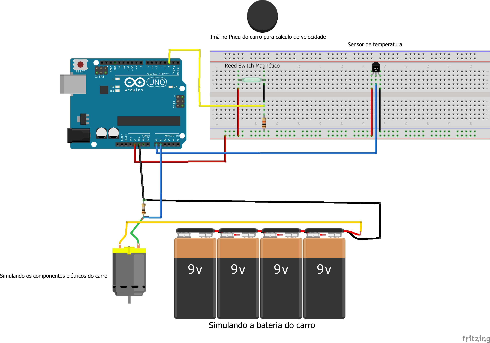
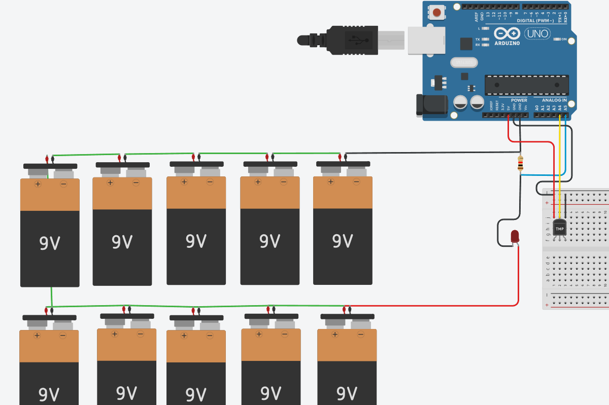

# SPRINTS - TECH MAHINDRA (Python e Edge)

- [Hub de informações - Python](#hub-de-informações---python)
  - [Sobre o projeto](#sobre-o-projeto)
  - [Funcionalidades do Projeto](#funcionalidades-do-projeto)
  - [Objetivo do Projeto](#objetivo-do-projeto)
  - [Execução do projeto](#execução-do-projeto)
- [Circuito de Sensores - Edge](#circuito-de-sensores---edge)
   - [Sobre o Projeto](#sobre-o-projeto-1)
   - [Objetivo do Projeto](#objetivo-do-projeto-1)
   - [Simulação do Circuito](#simulação-do-circuito)
   - [Lista de componentes](#lista-de-componentes)
- [Integrantes do grupo](#integrantes-do-grupo)

## Hub de informações - Python

### Sobre o projeto

Você já imaginou ter um hub completo de informações sobre a Fórmula E em português? Esse projeto foi criado exatamente para isso! Combinando o poder do Arduino e Python, nosso objetivo é popularizar a Fórmula E no Brasil, fornecendo um ponto centralizado para todas as informações que você precisa sobre essa emocionante categoria de corrida.

### Funcionalidades do Projeto

- **Informações em Tempo Real**: Monitore a temperatura, velocidade e o consumo energético de um veículo em tempo real usando sensores integrados ao Arduino.
- **Próximos Eventos**: Fique por dentro dos próximos eventos da Fórmula E com detalhes sobre datas, locais e horários.
- **Equipes e Pilotos**: Acesse informações detalhadas sobre as equipes e pilotos, incluindo probabilidades de vitória, posição, pontos e muito mais.


### Objetivo do Projeto

Popularizar a Fórmula E no Brasil, tornando as informações sobre essa categoria de corrida mais acessíveis para o público em geral. Através deste projeto, esperamos aumentar o interesse e o conhecimento sobre os avanços tecnológicos e a sustentabilidade promovida pela Fórmula E.

### Execução do projeto

Para executar o projeto, siga as etapas abaixo:

1. Clone o repositório para o seu ambiente local:

   ```
   git clone https://github.com/Wisers-1ESS/Challenge-EdgePython.git
   ```

2. Navegue até o diretório do projeto:

   ```
   cd Challenge-EdgePython
   ```

3. Instale as dependências necessárias:

   ```
   pip install -r requirements.txt
   ```

4. Crie uma conta no <a href="https://console.sportradar.com/">SportRadar</a> para gerar uma chave privada da API utilizada no projeto.
   - Após entrar, acessa a área de **Applications** e selecione uma existente, ou crie uma nova.
   - Clique em **_Add Trials_** e selecione _Sports API_.
   - Pesquise **Formula E** e adicione na sua Application.
   - Uma chave API foi criada, copie ela em **_API Key_**.
5. Crie um arquivo `.env` na raiz do projeto e adicione as seguintes linhas:

   ```
   API_KEY=SUA_API_KEY_AQUI
   ```

   - Substitua `SUA_API_KEY_AQUI` pela sua chave privada da <a href="https://developer.sportradar.com/racing/reference/formula-e-overview" target="_blank">API SportRadar - Formula E</a>.
   - Salve o arquivo `.env`.

6. Execute o projeto:

   ```
   python main.py
   ```

Certifique-se de ter o Python e o pip instalados em seu ambiente antes de executar o projeto.

***Adendo***: Para utilizar os dados de telemetria do Arduino de forma simulada, siga as instruções abaixo:

1. Instale um emulador de porta serial, como o **com0com**.

2. Abra o **com0com** e configure um par de portas virtuais, por exemplo, COM1 e COM2.

3. Execute o arquivo `simular_arduino.py` em um terminal separado e defina uma das portas virtuais na inicialização do script, por exemplo, COM6:

   ```
   python simular_arduino.py
   ```

4. Execute o projeto principal em outro terminal e na opção 4, digite o nome da outra porta virtual configurada, por exemplo, COM7:

   ```
   python main.py
   ```

Dessa forma, você poderá simular a comunicação entre o Arduino e o Python para testar o projeto sem a necessidade de um Arduino físico.

## Circuito de Sensores - Edge

### Sobre o Projeto

O projeto consiste em um circuito de sensores para o carro elétrico da Formula E, coletando dados de temperatura, velocidade e consumo de energia. O circuito é composto por um Arduino Uno, um sensor de temperatura, um reed switch magnético e um imã no pneu do carro para cálculo de velocidade. O Arduino coleta os dados dos sensores e envia para o software em Python, que processa e exibe as informações em tempo real.

### Objetivo do Projeto

A ideia é que no futuro cada carro da Fórmula E possa utilizar um circuito semelhante para monitorar o desempenho de seus carros durante as corridas e disponibiliza-los para seus fãs de maneira fácil e intuitiva. Fazendo com que a categoria se torne mais popular e acessível para o público em geral.

### Simulação do Circuito

Aqui está a simulação do circuito completo no Fritzing.

<a href="./edge/sprintCod.ino">Link do código</a>

E aqui a simulação adaptada para o Tinkercad, sem o sensor de velocidade.

<a href="https://www.tinkercad.com/things/58NdPJE1c83-sprintedge?sharecode=v_PwgfuQXFmN3SI2Dt3uhuJ3maFtRYsnJ9u47CJ-eGw">Link da simulação no TinkerCad</a>

### Lista de componentes

<table>
  <thead>
   <tr>
    <th>Quantidade</th>
    <th>Descrição</th>
    <th>Peça</th>
    <th>Propriedades</th>
    </tr>
  </thead>
  <tbody>
  <tr>
    <td>1</td>
    <td>Arduino Uno</td>
    <td>Arduino Uno (Rev3) - ICSP</td>
    <td class="props">tipo Arduino UNO (Rev3) - ICSP</td>
</tr><tr>
    <td>1</td>
    <td>Imã no Pneu do carro para cálculo de velocidade</td>
    <td>MAGNET</td>
    <td class="props">variante 18mm; pacote magnet-18mm</td>
</tr><tr>
    <td>1</td>
    <td>R1</td>
    <td>0.1Ω Resistor</td>
    <td class="props">tolerância ±5%; resistência 0.1Ω; pacote 1206 [SMD]</td>
</tr><tr>
    <td>1</td>
    <td>R2</td>
    <td>10kΩ Resistor</td>
    <td class="props">tolerância ±5%; resistência 10kΩ; pacote 0603 [SMD]</td>
</tr><tr>
  <td>1</td>
    <td>Reed Switch Magnético</td>
    <td>Reed switch</td>
    <td class="props">pacote THT</td>
</tr><tr>
  <td>1</td>
    <td>Sensor de temperatura</td>
    <td>TMP36</td>
    <td class="props">interface analog; variante to-92-kit; pacote to-92-kit</td>
</tr><tr>
  <td>1</td>
    <td>Simulando a bateria do carro</td>
    <td>Battery block 9V</td>
    <td class="props">tensão 9V</td>
</tr><tr>
  <td>1</td>
    <td>Simulando os componentes elétricos do carro</td>
    <td>DC Motor</td>
    <td class="props"></td>
</tr>
  </tbody>
</table>


## Integrantes do grupo

- Matheus Queiroz - RM558801
- Matheus Vinícius- RM555177
- Enzo Miletta - RM98677
- Marcela Torro - RM557658
- Lucas Son - RM554724